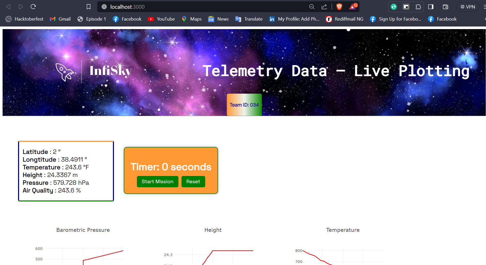
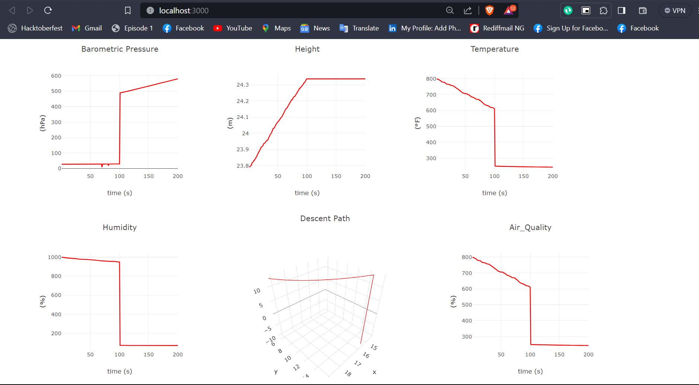

# INFISKY

## Ground Station
This repository hosts the software of our Ground Station. Specifically, we use a Python script to save telemetry data from a serial port to a JSON file and we create real-time graphs of Barometric Pressure, Temperature, Altitude, UV Radiation, and Soil Moisture concerning time, using React.js and Plotly.js, with the data received from our satellite. We also create a real-time 3D plot of the satellite's path since separation from the rocket.

## Screenshots
| App pic1                            |  
| ----------------------------------- | 
|  |
|App pic                            |   
|  |
